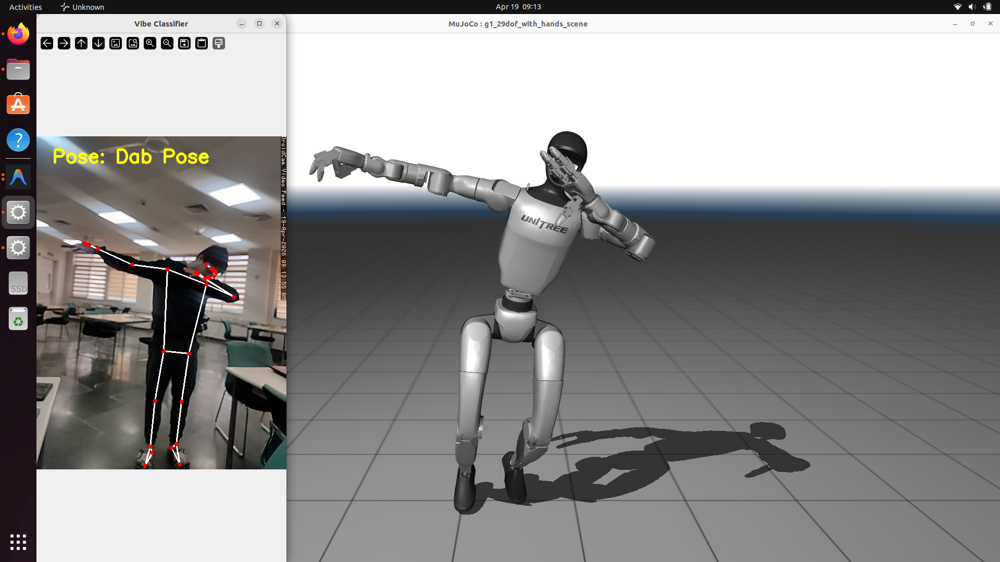

# Building a Real-Time Humanoid Motion Retargeting Pipeline: A Retrospective



Hey! I wanted to write down everything I went through while building our real-time motion retargeting pipeline (`webcam_to_gmr.py`). It was a massive learning experience bridging AI, robotics, and 3D math. Here is a breakdown of how the codebase works, the wild bugs I ran into, how I fixed them, and what I ultimately learned.

---

## 🏗️ The Architecture (How it works)
The goal of this pipeline is to take a live video feed of a person (from a phone or USB webcam) and make a 3D humanoid robot (the Unitree G1) mimic their movements in a physics simulation (MuJoCo) in real-time.

It runs in a sequential loop:
1. **The Camera Stream**: OpenCV captures a live frame from the camera.
2. **Pose Estimation (ROMP)**: We pass the image through a PyTorch neural network called ROMP. ROMP looks at the 2D image and estimates the 3D rotation of 24 human body joints using SMPL parameters.
3. **Forward Kinematics**: We take those raw joint rotations and calculate the absolute position and orientation of every body part in 3D space.
4. **Motion Retargeting (GMR)**: We feed those 3D positions into General Motion Retargeting (GMR), which uses an Inverse Kinematics (IK) physics solver to figure out how to bend the robot's physical motors so that its limbs match the human's limbs.
5. **Rendering**: We render the final robot pose in a MuJoCo 3D window.

Sounds simple on paper, but integrating these pieces caused a ton of headaches.

---

## 🐛 The Problems I Faced & How I Tackled Them

### Problem 1: The Robot was Upside-Down and Underground!
When I first got ROMP talking to the robot, the robot spawned completely upside-down, hanging underneath the virtual floor like a bat.
* **The Cause:** OpenCV and standard cameras use a "Y-Down" coordinate system (Y points to the floor). But MuJoCo and robotics environments use a "Z-Up" Cartesian coordinate system (Z points to the sky).
* **The Fix:** I had to derive a specific 3x3 Coordinate Transformation Matrix to flip the world 180 degrees and remap the axes. I multiplied the human pose by this matrix right before sending it to the robot.

### Problem 2: The Multi-Second Network Lag
When using my phone as an IP webcam over Wi-Fi, the robot was severely lagging behind my movements by 3 to 4 seconds.
* **The Cause:** OpenCV silently queues and buffers network video frames. Because the AI model takes about 30–40 milliseconds to process a frame, it couldn't keep up with the camera's 60 FPS output. The queue filled up with old frames, causing a massive backlog.
* **The Fix:** I wrote a custom `CameraStream` class using Python `threading`. It spins up a background thread that aggressively rips frames from the network stream at max speed and throws them away, storing only the absolute newest one. When the AI is ready, it grabs that newest frame. This completely bypassed OpenCV's buffer and brought latency down to near zero!

### Problem 3: Violent Jitter & The Axis-Angle Trap
The robot's arms and legs would randomly snap, violently spin around, and jitter uncontrollably.
* **The Cause:** I tried to smooth out the AI's predictions by applying an Exponential Moving Average (EMA) filter directly to ROMP's raw output (which is formatted as "axis-angles"). Mathematically, you *cannot* linearly interpolate axis-angles! If an angle crosses a boundary (like moving from +180 to -180 degrees), the average becomes 0, causing the robot's arm to violently snap to a zero position.
* **The Fix:** I completely removed the filter from the human AI side. Instead, I moved the EMA filter to the very end of the pipeline, smoothing the final output of the robot's physical joints (`robot_qpos`). I also added logic to safely handle quaternion sign flips. Result: Buttery smooth physical movement.

### Problem 4: Jumping vs. Squatting (The Monocular Camera Dilemma)
I wanted the robot to be able to jump, but also do squats. I wrote a custom ground calibration routine to unlock the robot's feet from the floor so it could jump. However, when I tried to do a squat, the robot's torso froze in mid-air, and its legs awkwardly pulled up underneath it!
* **The Cause:** Because we only use a single 2D webcam, the AI has no true depth perception. It relies on the size of the "bounding box" around my body. When I squatted, the bounding box shrank. The AI thought I was just moving *further away* from the camera, not moving down!
* **The Fix:** I had to make a tough choice. I scrapped the jumping code and re-enabled GMR's `offset_to_ground=True` flag, which acts like superglue and forces the lowest foot to stay at `Z=0` on every frame. Now, when I bend my legs, the glued feet physically drag the floating pelvis down, creating a perfect squat. (Tradeoff: jumping is practically impossible with a single webcam).

### Problem 5: The "Molasses" Physics Solver
Even after fixing the jitter, the robot felt very stiff, like it was moving through thick mud.
* **The Cause:** The Inverse Kinematics (IK) solver has a `damping` parameter set to `0.5` by default to prevent robots from moving too fast and breaking themselves.
* **The Fix:** Since my new EMA filter was already making the movement smooth, I dropped the solver's damping all the way down to `0.01`. This completely removed the artificial stiffness and made the robot highly responsive.

---

## 🧠 What I Learned

1. **3D Math is Unforgiving:** I learned the hard way about the differences between Euler angles, Axis-Angles, and Quaternions. You can't just apply basic math (like averages) to 3D rotations without causing chaotic behavior.
2. **Coordinate Systems Matter:** "Up" is not always "Up." You have to explicitly map camera space to physics world space.
3. **The Limits of Monocular Vision:** You can only extract so much 3D information from a 2D image. Estimating absolute vertical height (root translation) from a single lens is notoriously difficult due to scale ambiguity.
4. **Asynchronous Streams:** Whenever you are capturing real-time data from a network, you *must* use threading to manage the buffer, otherwise, you will inevitably succumb to latency buildup.

Overall, it was incredibly satisfying to finally see the Unitree G1 accurately mimicking my movements in real-time without latency or jitter!

---

## 📂 Project Structure

- **`webcam_to_gmr.py`**: The core pipeline script described above. Captures webcam video, runs pose estimation, and feeds the output into the physics-based retargeting solver for the Unitree G1 robot.
- **`ROMP/`**: Contains the ROMP (Robust One-stage Method for Person) pose estimation model code, used for fast 3D human pose and shape estimation from monocular images.
- **`GMR/`**: General Motion Retargeting repository. Provides the underlying Inverse Kinematics (IK) solver based on MuJoCo to map SMPL joint targets to the physical robot structure.
- **`setup_env.sh`**: A shell script containing the required commands to set up the Python environment (like `romp_gmr_env`) and install all necessary dependencies for running the pipeline.
- **`vibe_mocap/`**: Additional mocap implementations and scripts.
- **`app/`**: Contains application-level logic or frontend components for visualising the robot data.

## 🚀 Getting Started

1. **Environment Setup**: Ensure you have a suitable Python environment. You can use the provided setup script:
   ```bash
   bash setup_env.sh
   ```
2. **Run the Pipeline**: Execute the core motion retargeting script:
   ```bash
   python webcam_to_gmr.py
   ```
   *Make sure you have your webcam connected, or update the video source in the script if using an IP camera/phone!*
